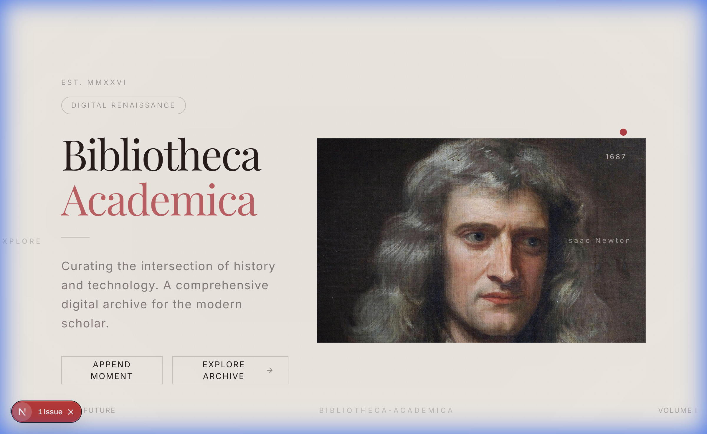
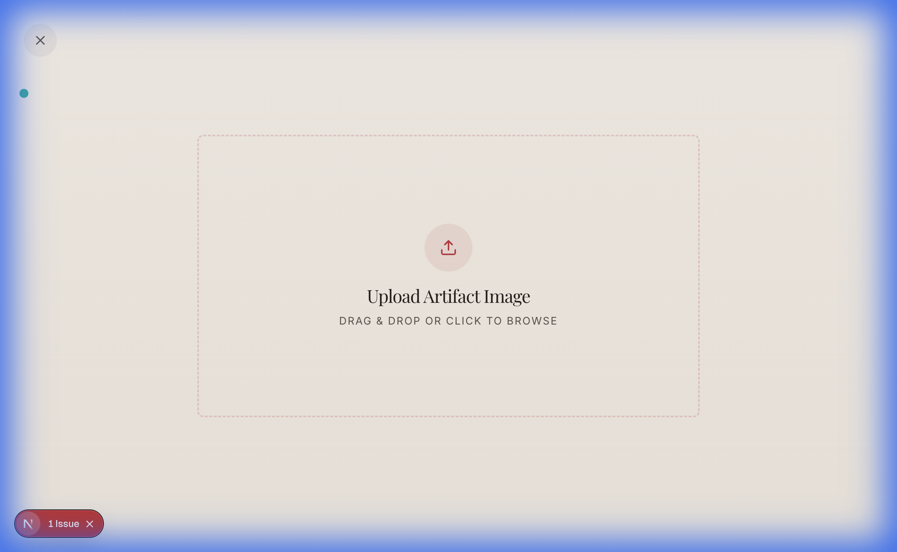

# Bibliotheca Academica



> **"Curating the intersection of history and technology. A comprehensive digital archive for the modern scholar."**

**Bibliotheca Academica** is not just a digital archive; it is a **Digital Renaissance** platform designed to transform the mundane act of data entry into an immersive art of curation. Built with modern web technologies but crafted with a classical soul, it bridges the gap between the static archives of the past and the fluid, interactive experiences of the future.

## The Philosophy: Visual First

In an age of information overload, we believe that **context is king**. Standard databases treat history as rows in a table. Bibliotheca Academica treats every entry as a **Moment in Time**—a visual, textual, and interconnected artifact that deserves to be experienced, not just indexed.

*   **Immersion**: Every interaction is fluid, featuring physics-based animations that give weight and presence to digital objects.
*   **Aesthetics**: Influenced by classical typography (`Cinzel`, `EB Garamond`) and modern minimalism (`Geist Sans`), creating a reading environment that respects the content.
*   **Curator Experience**: We don't have "forms". We have canvases.

## Key Features

### The Gallery (Archive View)
An infinite, horizontal scroll through history. Each artifact is presented as a high-fidelity card, breathing with subtle parallax effects.

### The Narrative (Detail Experience)

Clicking any artifact opens a seamless overlay—no page reloads, no context switching. Users can deep dive into the **Moment in Time**, explore **Figures**, and read the **Narrative** in a distraction-free environment.

### Append Moment (Curator Editor)

The crown jewel of the platform. We replaced the traditional "Create New" form with **"Append Moment"**.
1.  **Visual Anchor**: Start by dragging an artifact image onto the canvas.
2.  **Edit in Place**: The image becomes your background. You type directly onto the page—editing the title, figure, and narrative exactly where they will appear.
3.  **Seamless Integration**: The editor lives as a high-performance overlay, accessible instantly from the home feed.

## Technology Stack

This project is engineered as a **Single Page Application (SPA)** with potential for Electron desktop packaging.

-   **Core**: Next.js 15 (App Router), React 19, TypeScript
-   **Styling**: Tailwind CSS v4, Oklch Color Space
-   **Motion**: Framer Motion, GSAP, React Lenis (Smooth Scroll)
-   **3D Elements**: React Three Fiber / Drei
-   **Architecture**: Overlay-based routing, local state persistence (planned)

## Getting Started

1.  Clone the repository.
2.  Install dependencies:
    ```bash
    npm install
    ```
3.  Run the development server:
    ```bash
    npm run dev
    ```
4.  Open `http://localhost:4321` to begin curating.

---
*Est. MMXXVI · Bibliotheca Academica*
